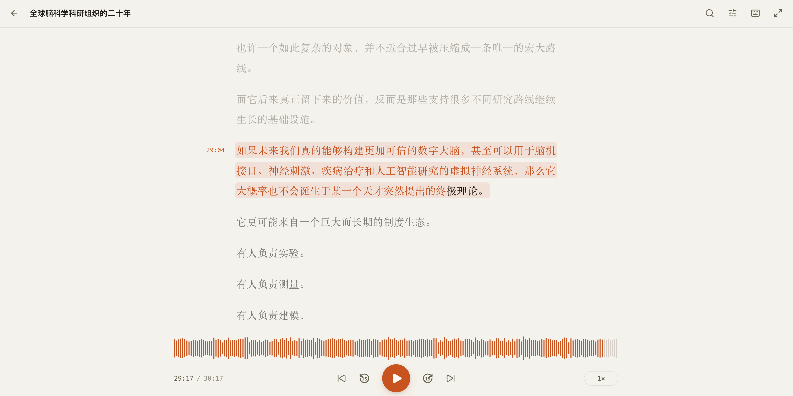
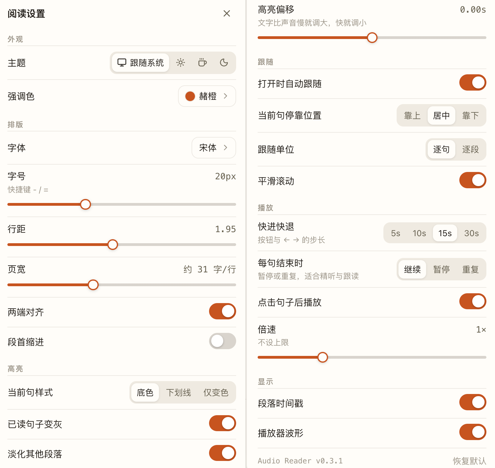

# Audio Reader · 有声文稿

一个「边听边读」的网页：放入音频、字幕文件和原稿（可选），文字会跟着声音逐句高亮、自动滚动。
所有文件只保存在你的浏览器里，不会上传到任何服务器。

**在线使用**：https://marksonchen.github.io/audio-reader/ （试试提供的示例）



技术细节：见 [DEVELOPER.md](DEVELOPER.md)。

## 怎么用


1. 把三个文件一起拖进首页，或点击选择：
   - **音频**（必需）：MP3、M4A、WAV、Opus、OGG、FLAC 等浏览器能播放的任何格式
   - **字幕**（必需）：SRT、VTT、LRC，或下面工具生成的逐词字幕
   - **原稿**（可选）：TXT 或 Markdown。提供后正文按原稿显示，时间从字幕借用
2. 点「开始阅读」。文件会存在浏览器本地，下次在首页「最近打开」里直接继续。

## 想要逐字渐变？先生成逐词字幕

普通字幕只知道每一句从哪秒到哪秒，所以阅读时是**整句整块地变色**。
如果字幕精确到每一个词，文字就会**跟着声音一个字一个字地点亮**。仓库里带了一个把普通字幕变成逐词字幕的命令行工具：

```bash
# 1. 安装 uv（Python 工具，一次即可）：https://docs.astral.sh/uv/getting-started/installation/
# 2. 取得仓库
git clone https://github.com/MarksonChen/audio-reader.git
cd audio-reader
# 3. 音频 + 普通字幕（或原稿）→ 逐词字幕；首次运行会自动准备环境并下载约 460 MB 的模型
uv run scripts/align.py 音频.mp3 字幕.srt
```

它会在音频旁边写出 `音频.words.srt`（和一份 `.words.json`）。把这个文件当作「字幕」放进网页，原稿照旧放原稿，就有逐字渐变了。
30 分钟的音频在 Apple M 系列芯片上约 1 分钟；文字和音频有出入的地方（比如念的时候漏了几个字）会被自动跳过。

## 阅读设置



右上角的滑杆图标（或 ⌘ ,）打开，分六组：

- **外观**：主题（跟随系统 / 浅色 / 纸张 / 深色）、强调色（90 种中国传统色，也可自定义任意颜色）
- **排版**：字体（只列出本机可用的）、字号、行距、页宽、两端对齐、段首缩进
- **高亮**：当前句样式（底色 / 下划线 / 仅变色）、已读句子变灰、淡化其他段落、高亮偏移
- **跟随**：打开时自动跟随、当前句停靠位置、跟随单位（逐句 / 逐段）、平滑滚动
- **播放**：快进快退步长、每句结束时（继续 / 暂停 / 重复）、点击句子后播放、倍速
- **显示**：段落时间戳、播放器波形

倍速也可以直接点播放器右下角的倍速按钮：± 0.05（按住连续）、拖滑杆、或直接输入数字。
所有设置会自动保存，「恢复默认」一键还原。

## 快捷键

| Mac | Windows / Linux | 作用 |
| --- | --- | --- |
| 空格 / K | 空格 / K | 播放 / 暂停 |
| ← / → | ← / → | 后退 / 前进（步长可设，⇧ / Shift 为微调） |
| ⌥ ← / → | Alt + ← / → | 上一句 / 下一句 |
| ⌥ ↑ / ↓ | Alt + ↑ / ↓ | 上一段 / 下一段 |
| [ / ] | [ / ] | 减速 / 加速 0.05（⇧ / Shift 为 0.25） |
| - / = | - / = | 缩小 / 放大字号 |
| F | F | 开关自动跟随 |
| Enter | Enter | 回到当前句 |
| Z | Z | 专注阅读，隐藏上下栏（Esc 退出） |
| ⌘F 或 / | Ctrl + F 或 / | 搜索正文，回车跳转 |
| ⌘ , | Ctrl + , | 阅读设置 |
| ? | ? | 快捷键帮助 |

触屏：正文上左右滑动前后跳，双击播放 / 暂停，从播放器向上滑呼出设置。

## 常见问题

- **文字为什么是整块变色，而不是一个字一个字点亮？** 因为普通字幕只精确到句。用上面的工具生成逐词字幕即可。整体偏早或偏晚可在设置里微调「高亮偏移」。
- **原稿和字幕内容差别很大？** 匹配不到的句子会以虚线下划线标出；匹配度过低时会改用字幕文字显示。
- **某个字体在列表里找不到？** 只显示本机安装且已启用的字体；在「字体册」里启用后刷新页面即可。
- **换了浏览器或清了数据？** 文件只存在当时的浏览器里，需要重新放入。
